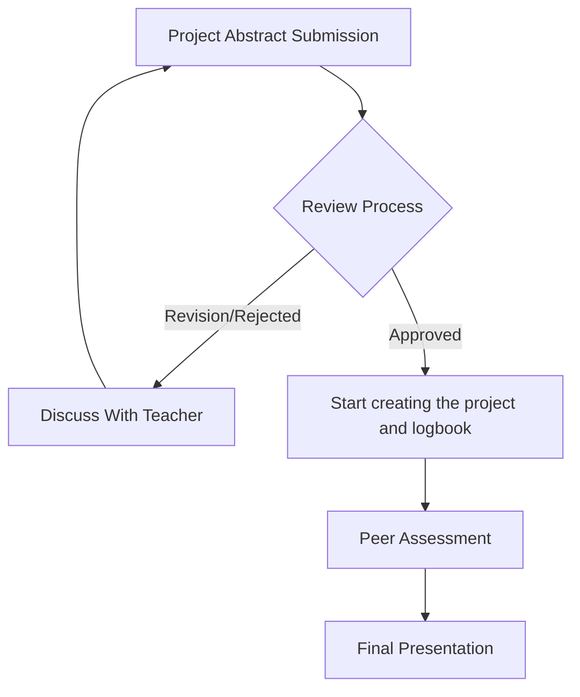

# STEAM Project Guidance Book

## 1. What is this STEAM project?
The STEAM (Science, Technology, Engineering, Arts, and Mathematics) project is an interdisciplinary initiative designed to foster innovation, critical thinking, problem-solving, and creativity among students. This project challenges students to identify a real-world problem, conceptualize a solution, and build a prototype or conduct a study using the Engineering Design Process (EDP). It emphasizes the process of making, including planning, failing, iterating, and presenting, rather than just delivering a final product.

## 2. General Flowchart
The project follows a structured timeline from conception to final presentation:

1. **Project Abstract Submission:** Students submit a summary of their proposed project, highlighting the problem, solution, and key concepts.
2. **Review Process:** The abstract is reviewed by the teacher.
3. **Discuss With Teacher:** If the abstract is rejected or requires revision, students must consult with their teacher to refine their ideas and resubmit.
4. **Start creating the project and logbook:** Once approved, students build their prototype. They must maintain a detailed logbook documenting all activities, failures, fixes, and reflections.
5. **Peer Assessment:** Students review and provide constructive feedback on their peers' projects or presentations.
6. **Final Presentation:** Students present their work, explain their process, and answer questions.

## 3. Abstract Submission Examples

When submitting a project abstract, it must include a Title, Problem, Solution, and Key Concepts. Here are general examples of what gets rejected, what needs revision, and what gets approved.

### Example 1: Rejected
* **Title:** The Volcano
* **The Problem:** Volcanoes erupt and look cool.
* **The Solution:** I will make a volcano out of clay and use baking soda and vinegar to make it erupt.
* **Key Concepts:** Science, Chemistry.
* **Reason for Rejection:** The problem is trivial and does not address a real-world issue. The solution is a standard demonstration, not an engineering design project. There is no real STEAM integration or technical feasibility planning.

### Example 2: Revision (Needs More Detail)
* **Title:** Water Filter Project
* **The Problem:** Water in some areas is dirty and not safe to drink. This is a big problem because people get sick. We want to make something to clean the water so people can use it.
* **The Solution:** We will build a water filter using sand, gravel, and charcoal. The filter will clean dirty water and make it safer. We will test it with dirty water from around the school.
* **Key Concepts:** 
  * **Chemistry:** We will use chemistry to filter the water.
  * **Environmental Science:** This project is about the environment because water is part of nature.
  * **Visual Design:** We will make the filter look nice and design a poster.
* **Reason for Revision:** The problem statement is too general and lacks specific, local context or evidence. The solution does not provide a clear engineering methodology or measurable constraints. The key concepts do not explain *how* the subjects are applied; simply mentioning the subject name is insufficient for demonstrating interdisciplinary integration.

### Example 3: Approved (Strong Example)
* **Title:** AquaPure: A Portable Bio-Sand Water Filtration System for Coastal Communities
* **The Problem:** Many coastal communities near our school in Batam face a serious problem with water quality. The groundwater in these areas is contaminated with sediment, bacteria, and traces of industrial waste from nearby factories. Families in these areas often cannot afford commercial water filters and rely on boiling water, which uses a lot of fuel and does not remove chemical contaminants. According to data from the local health center, waterborne diseases like diarrhea and skin infections are among the top 5 reasons people visit the clinic. This problem matters to us because some of our own classmates live in these communities and have experienced this issue firsthand. We chose this problem because clean water is a basic human right, and we believe that a simple, affordable, and science-based solution can make a real difference in the daily lives of people around us.
* **The Solution:** We will design and build a portable bio-sand water filtration system called "AquaPure." The filter uses a multi-layer approach: a top layer of fine sand for trapping large particles, a middle layer of activated charcoal for adsorbing chemical contaminants and removing odor, and a bottom layer of gravel for structural support and final drainage. The prototype will be built inside a clear PVC pipe (50cm tall, 10cm diameter) so users can see the layers and understand how it works. We chose this design because bio-sand filtration is a proven, low-cost technology recommended by the World Health Organization for household water treatment. Unlike commercial filters that cost hundreds of thousands of rupiah, our prototype can be built for under Rp 50,000 using locally available materials. We will test the filter by pouring water samples with known contaminants (muddy water, water with food coloring, and water with dissolved salt) through the system and measuring the output clarity using a turbidity test (light passing through the water) and pH test strips. We will run at least 5 trials per water type and record the results in a data table to compare input versus output quality.
* **Key Concepts:** 
  * **Chemistry:** Activated charcoal uses a process called adsorption. This means the carbon surface attracts and holds chemical molecules (like chlorine and organic pollutants) from the water. This is different from absorption — the chemicals stick to the surface of the charcoal rather than being soaked in. We will also use pH testing to measure the acidity of the water before and after filtration.
  * **Environmental Science:** This project connects to water pollution and conservation. We are studying how industrial runoff and poor waste management contaminate groundwater in coastal areas. Understanding the water cycle and how pollutants enter the water table helps us explain why filtration is needed at the household level.
  * **Physics:** The filter relies on the principle of gravity-driven flow. Water moves downward through each layer due to gravitational force. The rate of flow depends on the porosity and particle size of each layer — fine sand slows the water more than gravel, which gives more time for contaminants to be trapped. We will calculate the flow rate (volume per unit time) as part of our testing.
  * **Statistics & Probability:** We will use basic statistics to analyze our test results. After running multiple trials, we will calculate the mean turbidity reduction percentage, plot the data in a bar chart, and determine if our filter consistently reduces contaminants. This helps us make evidence-based conclusions rather than just saying "it works."
* **Reason for Approval:** The title is professional. The problem description is highly localized, uses hard data (clinic statistics), and shows deep empathy. The solution provides a realistic, highly detailed build plan (PVC pipe, layer structure), includes a budget constraint, and defines precise, measurable success criteria. The key concepts brilliantly demonstrate theoretical accuracy and how each STEAM discipline naturally integrates to make the project successful.

## 4. Assessment Rubrics Overview

The project is assessed using five distinct rubrics (C1 to C5), each representing a phase in the Engineering Design Process (EDP). 

* **C1 (Screening):** Used at the very beginning to evaluate the abstract. Decides if the idea is worth approving.
* **C2 (Ask & Research):** Evaluates if the students truly understand the problem, its causes, and the science behind it.
* **C3 (Imagine & Plan):** Assesses the generation of ideas, the selection of the best solution, and the detailed planning (budget, timeline, blueprints) before building.
* **C4 (Create, Test & Improve):** Evaluates the logbook to see if students executed and iterated like real engineers (documenting failures and fixes).
* **C5 (Communicate):** Assesses the final presentation and Q&A to see how well students can explain and defend their work.

---

### C1: STEAM Project Screening Rubric
**Purpose:** To filter projects based on their proposal (Abstract). Ensures the project is integrated and prototype-based.

| Dimension | Indicator | Level 1 (Beginning) | Level 2 (Developing) | Level 3 (Proficient) | Level 4 (Exemplary) |
| :--- | :--- | :--- | :--- | :--- | :--- |
| **1. Project Title** | **Clarity & Creativity** | Title is vague or unrelated. | Title is descriptive but generic. | Title clearly reflects the problem or solution. | Title is catchy, professional, and reflects the STEAM nature. |
| **2. Problem Statement** | **Contextuality & Relevance** | Abstract, no link to real-life. | Common problem, lacks specific local context. | Clearly linked to a real-life situation in community. | Significant, real-world issue; highly relevant. |
| | **Depth & Logic** | Too brief, lacks reasoning. | Clear but lacks evidence/cause-and-effect. | Well-explained, logical flow from cause to impact. | Analyzed deeply with clear evidence and structure. |
| | **Significance** | Trivial, doesn't need a solution. | Minor problem; solution provides little benefit. | Solving it provides clear benefit to specific people. | High impact or addresses a critical need. |
| **3. Proposed Solution** | **Rationale & Choice** | No reason given for choice. | Weak reason, based on "ease of making". | Explains choice based on ability to solve problem. | Compelling, evidence-based argument for choice. |
| | **Methodology** | No plan for building prototype. | Vague plan, lacks steps or materials. | Clear, step-by-step plan for building. | Highly detailed, realistic plan; Engineering mindset. |
| | **Feasibility** | Impossible to build. | Overly ambitious, likely to fail. | Realistic, can be built within timeline/budget. | Expertly balanced between challenging and achievable. |
| **4. Key Concepts** | **Subject Relevance** | Subject choices seem random. | Only one subject correctly identified. | Two or more subjects identified with clear relevance. | Multiple subjects (3+) integrated naturally. |
| | **Conceptual Accuracy** | Incorrectly defined or applied. | Concepts named, but explanation is weak. | Correctly defined, clear link to project function. | Deep, accurate understanding of how concepts drive project. |
| | **Interdisciplinary Link** | No connection shown. | Subjects treated as separate tasks. | Shows how one subject supports another. | Clearly demonstrates how subjects melt together into one solution. |

---

### C2: Ask and Research Rubric
**Purpose:** Evaluates the quality of the student's investigation. Checks understanding of technical limits and scientific theories.

| Dimension | Indicator | Level 1: Beginning | Level 2: Developing | Level 3: Proficient | Level 4: Exemplary |
| :--- | :--- | :--- | :--- | :--- | :--- |
| **I. Problem Definition** | **1. Problem Description** | Uses only personal opinions. No facts. | Hard to understand, relies mostly on opinions. | Explains causes and impact. Uses basic facts/data. | Exact causes and impact using strong facts and data. Professional. |
| | **2. Relevance & Constraints** | Not relevant. No limits listed. | Weak relevance. Vague limits. | Relevant. Lists specific, measurable goals/limits. | Highly relevant. Deep empathy and professional technical requirements. |
| **II. Information Literacy** | **3. Source Quality** | No credible sources. | Only one type of source. No expert data. | Credible resources (academic OR expert interview). | Highly credible (both academic AND expert interview). |
| | **4. Knowledge Synthesis** | Research copied and pasted. | Rewritten, but not linked to design choices. | Explains how specific data helps build prototype. | Perfectly explains "Research -> Action" link. |
| **III. Precedent Study** | **5. Existing Solutions** | No research on existing products. | Finds one product but no data on strengths/weaknesses. | Basic data on 1-2 existing solutions, identifies improvements. | Detailed data to identify a specific opportunity for something new/better. |
| **IV. STEAM Foundation** | **6. Theoretical Accuracy** | Explanations missing or major errors. | Simple language, avoids technical terms. | Correctly explains principles that make it work. | Uses advanced terms/formulas to prove deep understanding. |
| | **7. The "Mechanism"** | No explanation; treated like "magic". | Explains what it does, not how it logic works. | Provides a clear logic flow. | Highly detailed technical walkthrough of system interactions. |
| | **8. Subject Integration** | Unrelated list of subjects. | Simple link (one subject for a small task). | Functional link (one subject required for another). | Demonstrates Interdependence (project fails if one removed). |

---

### C3: Imagine & Plan Rubric
**Purpose:** Assesses if the group generated several ideas, chose one for good reasons, and produced a buildable plan with measurable targets.

| Dimension | Indicator | Level 1: Beginning | Level 2: Developing | Level 3: Proficient | Level 4: Exemplary |
| :--- | :--- | :--- | :--- | :--- | :--- |
| **I. Ideation & Selection** | **1. Divergent Ideas** | Only one idea shown. | Two ideas mentioned, but second is throwaway. | Three or more genuinely different ideas described. | Many distinct ideas, including bold/unusual ones. |
| | **2. Convergent Choice** | No reason, or "easiest one". | Reason is opinion-based, ignores criteria. | Chosen idea compared using C2 Success Criteria. | Uses structured method (decision matrix) to justify. |
| **II. Execution & Planning** | **3. Materials & Budget** | No materials/budget. | Some materials; budget missing/unrealistic. | Comprehensive list with realistic budget. | Exhaustive list with detailed, priced budget respecting constraints. |
| | **4. Timeline & Tasks** | No timeline/tasks. | Vague timeline; tasks unassigned. | Sequenced timeline with tasks assigned. | Realistic timeline with dependencies; genuine management. |
| **III. Design Spec** | **5. Visual / Blueprint** | No visual provided. | Messy, doesn't match plan. | Clear visual that maps to the plan. | High-quality blueprint a stranger could build from. |
| | **6. Test Plan** | No success criteria. | Vague goal with no test. | Lists targets and basic test plan. | Precise targets tied to constraints AND clear test procedure. |
| **IV. Risk & Contingency** | **7. Risk Assessment** | Ignores risk. | Generic risks; no Plan B. | Realistic risks with basic mitigation. | Specific foresight with strong, actionable Plan B. |
| **V. STEAM Application** | **8. Planned Application** | Concepts absent/decorative. | Leans on one discipline; others bolted on. | Applies 1-2 concepts to make solution function. | Requires multiple disciplines working together. |

---

### C4: Create, Test & Improve (Logbook) Rubric
**Purpose:** Evaluates the logbook to ensure it shows a true history of building, failing, testing, and improving as a team.

| Dimension | Indicator | Level 1: Beginning | Level 2: Developing | Level 3: Proficient | Level 4: Exemplary |
| :--- | :--- | :--- | :--- | :--- | :--- |
| **I. Structure** | **1. Organization & Dates** | Incoherent, no dates. | Disorganized, missing dates/gaps. | Clear structure, most dates, logical flow. | Professional: every session dated and ordered. |
| **II. Problem-Solving** | **2. Failures & Fixes** | Only successes. | Problems listed without solutions. | Problems and solutions recorded. | Failure analyzed with full iteration path to fix. |
| | **3. Plan Fidelity** | No reference to plan. | Deviations happen silently. | Notes when build differed from plan. | Explains every deviation with engineering reason. |
| **III. Testing** | **4. Tests & Data** | No testing. | Vaguely mentions testing; no results. | Records tests with basic results against criteria. | Logs structured tests with real measurements/data. |
| | **5. Evidence-Based** | Changes random/cosmetic. | Changes made, but not from test data. | Test results drive at least one change. | Loop of test -> measure -> decide -> change recurs. |
| **IV. Reflection** | **6. Self-Assessment** | None. | Superficial reflection. | Recognizes progress and learning moments. | Deep reflection balancing struggles and achievements. |
| **V. Task Description** | **7. Descriptive Precision** | Missing or just names. | Vague/repetitive descriptions. | Clear entries specifying work done. | Vivid descriptions leaving zero ambiguity about technical work. |
| **VI. Collaboration** | **8. Division of Labor** | Unclear who did what. | Appears done by one person. | Tasks shared across members. | Balanced contribution with coordination visible. |
| | **9. Decision-Making** | None. | Decisions without discussion. | Records key decisions made together. | Documents team debates and conflict resolution. |

---

### C5: Communicate (Presentation & Q&A) Rubric
**Purpose:** Judges how well students can convey their EDP journey and defend it under questioning.

| Dimension | Indicator | Level 1: Beginning | Level 2: Developing | Level 3: Proficient | Level 4: Exemplary |
| :--- | :--- | :--- | :--- | :--- | :--- |
| **I. Problem Framing** | **1. Story & Significance** | Problem unclear. | Flat statement, no "why it matters". | Frames problem clearly, explains significance. | Compelling hook makes significance undeniable. |
| **II. Explaining Solution**| **2. How It Works** | Treats as "magic". | Says what it does, not how. | Walks through logic of how it works. | Crystal-clear technical walkthrough. |
| | **3. STEAM Reasoning** | No concepts named. | Names concepts but not connections. | Explains how 1-2 concepts drive solution. | Shows disciplines working together with interdependence. |
| **III. Evidence of EDP** | **4. Showing Process** | Shows only final product. | Mentions changes with no detail. | Shows at least one real iteration. | Presents full journey (failures, tests, improvements). |
| | **5. Limitations & Next Steps** | Claims perfection. | Vague "could improve". | Names real limitation and next step. | Sharp critique with credible improvement roadmap. |
| **IV. Delivery** | **6. Participation & Timing**| One dominates. | Uneven sharing. | Reasonably even participation. | Seamless hand-offs, everyone contributes. |
| | **7. Visual Aids & Demo** | Missing/cluttered. | Distracting or hard to read. | Clear visuals; prototype shown. | Polished visuals and effective live demo. |
| **V. Q&A Defense** | **8. Depth Under Pressure**| Cannot answer. | Surface-level answers. | Answers most correctly with reasons. | Confident evidence-based answers to tough questions. |
| | **9. Intellectual Honesty**| Bluffs/invents. | Deflects/hides gaps. | Admits when unsure. | Admits unknowns gracefully and proposes how to find answer. |

## 5. Logbook Documentation Example (C4 Dimension)

### What to write in the Logbook?
The logbook must follow the app's template. It consists of four main fields:
- **Date**: The exact date the work was performed.
- **Task**: Describe exactly what you plan or intend to do during this work session.
- **Result**: What you actually achieved or what happened in the end (this may include more than one result, so you can use bullets or numbering).
- **Feedback**: What you learned, the analysis of any failures or struggles, and the plan for the next session.

---

### Example 1: Proper Logbook (Good Example)
**Date**: October 15, 2023
**Task**: We will write the initial Arduino code to read data from the moisture sensor and output it to the serial monitor. We will also integrate the relay module for the water pump.
**Result**: 
1. We successfully wrote the basic sketch and uploaded it.
2. **Failure:** The sensor readings were very erratic, jumping from 10 to 1023 randomly.
3. **Fix:** We researched online and found that the sensor needed a pull-down resistor. We also noticed our jumper wires were loose, so we soldered the connections.
4. The relay now clicks correctly when the moisture reading drops below 300.
**Feedback**: 
- **Analysis:** Loose wires cause unstable analog readings. We learned that physical connections are just as important as the code. 
- **Next Plan:** Tomorrow, we will connect the actual 5V pump to the relay and test the water flow in a cup of dry soil. We also realized we need to add a time delay in the code to prevent flooding.

**Why this is a Good Logbook (C4 Alignment):**
- **Depth of Task Description:** It clearly specifies the technical work planned (Arduino coding, relay integration) rather than just saying "we did code".
- **Problem-Solving Loop:** It honestly documents a specific failure (erratic readings) and details the exact steps taken to fix it (adding a resistor and soldering).
- **Testing & Evidence:** It provides specific data (jumping from 10 to 1023, threshold of 300) to prove the results.
- **Reflection:** Includes a genuine analysis of what was learned and a clear, logical "Plan B" / next step.

---

### Example 2: Bad Logbook (Improper Example 1)
**Date**: October 15, 2023
**Task**: Work on the project and code.
**Result**: 
- We coded the Arduino. 
- It works perfectly on the first try.
**Feedback**: 
- It was fun. Next we will build the box.

**Why this is a Bad Logbook:**
- **Depth of Task Description (Level 1/2):** "Work on the project" is extremely vague. It tells the reader nothing about the actual technical task being performed.
- **Problem-Solving Loop (Level 1):** Claiming "it works perfectly on the first try" usually indicates the student is hiding their struggles. There is zero evidence of the engineering iteration process. 
- **Reflection (Level 1/2):** "It was fun" is highly superficial. There is no real analysis of personal growth, struggle, or what was technically learned.

---

### Example 3: Bad Logbook (Improper Example 2)
**Date**: October 20, 2023
**Task**: Test the water pump.
**Result**: 
- Pump turns on.
- Water comes out.
- Sensor broke.
**Feedback**: 
- We need a new sensor.

**Why this is a Bad Logbook:**
- **Testing & Evidence (Level 1/2):** It lacks any real measurements or data. How much water came out? What were the test conditions?
- **Problem-Solving Loop (Level 2):** It mentions a problem ("Sensor broke") but fails to provide an analysis of *why* it broke or how they plan to avoid breaking it next time. The feedback is just "we need a new sensor," which lacks engineering thought and iteration.
